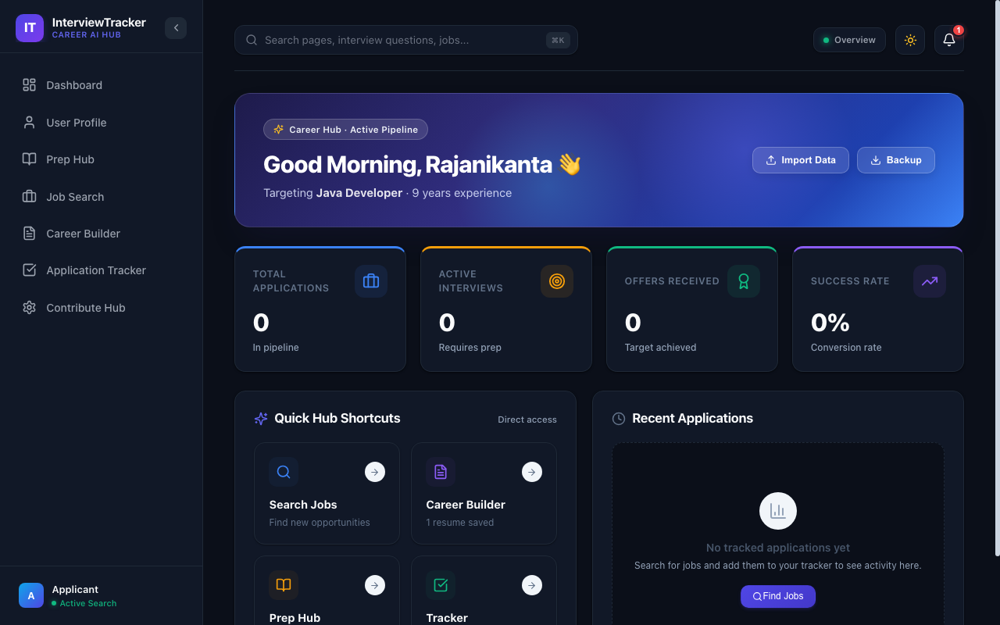
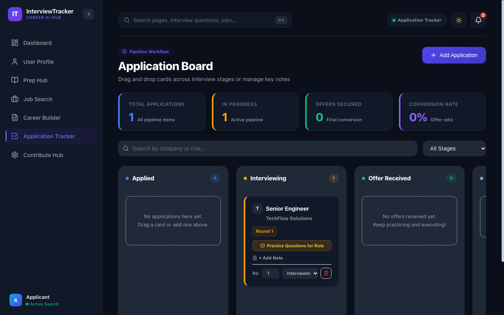
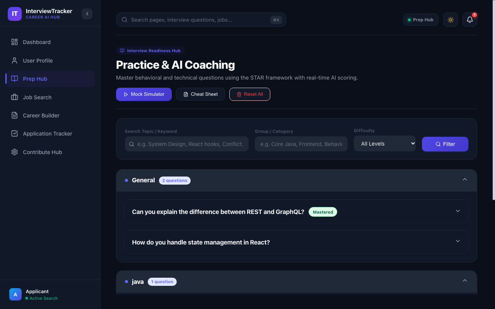
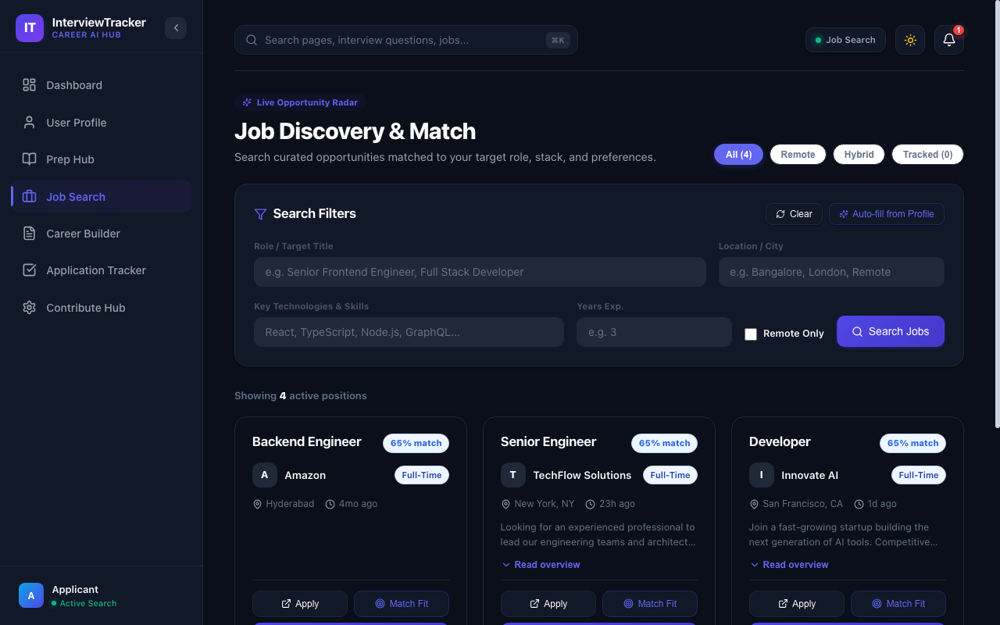
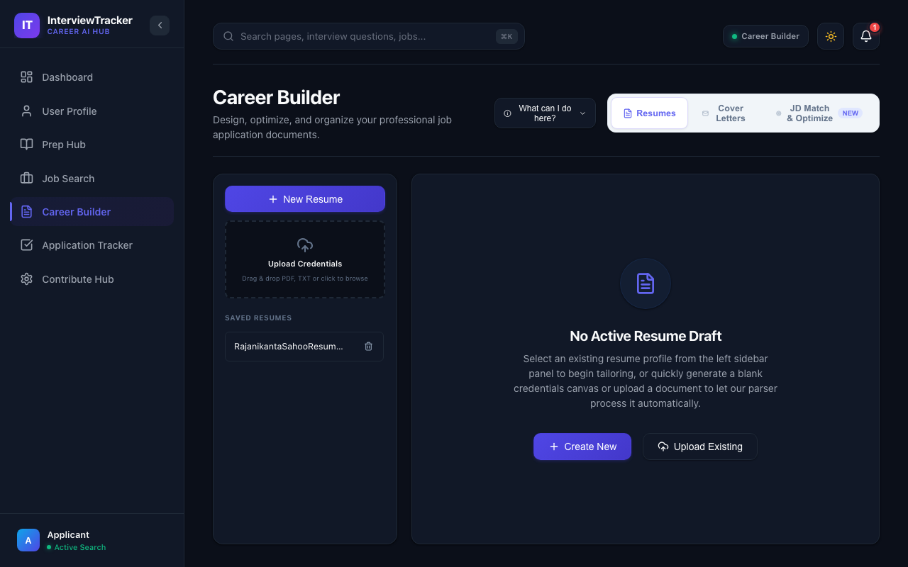
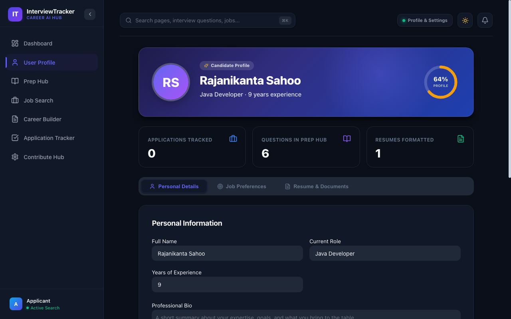

# 🎯 Interview Tracker & Career Accelerator

<p align="center">
  
  
  
  
  
  
  
  
</p>

An all-in-one, full-stack career platform designed to help candidates prepare for technical interviews, track application pipelines with automated countdowns, analyze job descriptions, and craft ATS-optimized resumes.

Built with **React 19**, **Vite**, **Express**, **Nginx**, and **Node.js**.

---

## 📑 Table of Contents
- [✨ Key Features](#-key-features)
- [📸 Screenshots & Walkthrough](#-screenshots--walkthrough)
- [🔄 Cross-Module Workflows](#-cross-module-workflows)
- [🛠️ Technology Stack](#️-technology-stack)
- [🏗️ System Architecture](#️-system-architecture)
- [🚀 Getting Started](#-getting-started)
  - [Option A: Docker Compose (Recommended)](#option-a-run-with-docker-compose-recommended)
  - [Option B: Local Node.js Development](#option-b-run-locally-with-nodejs)
- [🔌 API Endpoints Reference](#-api-endpoints-reference)
- [🧪 Testing & Code Quality](#-testing-code-quality)
- [⌨️ Keyboard Shortcuts & Accessibility](#️-keyboard-shortcuts--accessibility)
- [📁 Project Directory Structure](#-project-directory-structure)
- [📄 License](#-license)

---

## ✨ Key Features

- 📊 **Interactive Analytics Dashboard**: Visual progress metrics, pipeline velocity, prep milestone counters, and quick actions.
- 📋 **Kanban Application Tracker**: Drag-and-drop workflow across stages (*Applied*, *Interviewing*, *Offer Received*, *Archived*), with interview dates, round types, and live countdown badges (*"In 2 days"*, *"Today"*).
- 🎙️ **Mock Interview Simulator & Prep Hub**: 
  - Timed 2-minute mock interview simulator with Web Audio API chime notifications.
  - Speech-to-Text voice dictation (via Web Speech API) for speaking answers aloud.
  - Interactive STAR method coach with real-time impact scoring and printable interview cheat sheets.
- 🔍 **Job Discovery & 1-Click Match Fit**: Search tech listings with location and remote filters. Instantly port any job description to the ATS matcher with 1-click **"Match Fit"**.
- 📄 **Resume Builder & ATS Gauge**: Real-time keyword scoring against specific job descriptions, section-by-section editing, and ATS compliance checks.
- 👤 **Candidate Profile & Smart Auto-Fill**: Upload existing PDF or DOCX resumes to automatically populate candidate info, role preferences, bio summaries, and skills matrices.
- 🌓 **Adaptive Light & Dark Themes**: First-class dark mode support with smooth transitions and theme persistence.
- ⚡ **Universal Command Palette (`⌘K` / `Ctrl+K`)**: Rapid keyboard navigation across pages, theme toggles, modal triggers, and JSON data backup.
- 🖨️ **Print & PDF Engine**: Dedicated print stylesheet optimizing resumes and interview cheat sheets for standard A4 / US Letter export without UI chrome.
- 🛡️ **Rogue Extension Defense**: Viewport lock and DOM mutation observers that isolate and block unauthorized third-party extension injection.

---

## 📸 Screenshots & Walkthrough

### 1. Overview Dashboard
High-level visibility into your entire job hunt: active pipeline counts, upcoming interviews, practice momentum, and quick launcher shortcuts.



---

### 2. Kanban Application Tracker
Track application lifecycles from first outreach to signed offer. Add interview dates, times, and round types with real-time countdown alerts, and jump directly into role-tailored interview practice.



---

### 3. Preparation Hub & Mock Interview Simulator
Browse categorized interview questions across frontend, backend, system design, and behavioral categories. Launch the **Mock Interview Simulator** to practice STAR answers under a 2-minute timer with voice-to-text dictation and audio prompts.



---

### 4. Job Discovery & 1-Click ATS Fit
Discover active openings filtered by role, tech stack, and remote flexibility. Click **Match Fit** on any job card to instantly analyze how well your credentials align with the role's requirements.



---

### 5. Resume Builder & ATS Scorer
Format ATS-friendly resumes with live previewing, automated bullet point guidance, and keyword gap analysis against target job descriptions.



---

### 6. Candidate Profile & Resume Auto-Fill
Manage your career narrative, social links, and skills matrix. Upload an existing resume to automatically parse and extract your experience and profile details.



---

## 🔄 Cross-Module Workflows

The application connects job searching, resume tailoring, application tracking, and interview preparation into an integrated pipeline:

```
┌─────────────────┐       Match Fit (1-Click)       ┌────────────────────────┐
│   Job Search    │ ──────────────────────────────> │ Resume Builder         │
│  (Find listing) │                                 │ (Prefilled JD Matcher) │
└────────┬────────┘                                 └────────────────────────┘
         │
         │ Track Application (1-Click)
         v
┌─────────────────┐       Practice Role Qs          ┌────────────────────────┐
│  Kanban Tracker │ ──────────────────────────────> │ Preparation Hub        │
│(Date, Time, Countdown)                            │ (Filtered Role Bank &  │
└─────────────────┘                                 │  Mock Simulator)       │
                                                    └────────────────────────┘
```

1. **Job Search ➔ Resume Builder**: Clicking **Match Fit** on any job card packages the role title, company, and JD text into `sessionStorage` and immediately opens the ATS Matcher tab prefilled.
2. **Tracker ➔ Prep Hub**: Clicking **Practice Questions for Role** on an active interview card filters the questions bank specifically for that position.

---

## 🛠️ Technology Stack

| Layer | Technologies |
| :--- | :--- |
| **Frontend** | React 19, React Router v7, Lucide Icons, Vite |
| **Styling** | Vanilla CSS3 with CSS Custom Properties (Theme tokens & dark mode), Media Print |
| **Web APIs** | Web Speech API (`SpeechRecognition`), Web Audio API (`AudioContext`, `OscillatorNode`), `sessionStorage`, `localStorage` |
| **Backend** | Node.js 20, Express 4.19, Multer, PDF-Parse, Mammoth (.docx parser), Cheerio |
| **Reverse Proxy** | Nginx 1.27 Alpine with Gzip compression and SPA fallback routing |
| **Containerization** | Docker, Docker Compose (Multi-stage builds, non-root user execution) |
| **Data Persistence** | Dual-storage engine: local JSON database (`backend/db.json`) synced with client local state |

---

## 🏗️ System Architecture

```
                      ┌──────────────────────────────────────────────┐
                      │                 Client Browser               │
                      └──────────────────────┬───────────────────────┘
                                             │
                                             │ HTTP Port 3000
                                             v
                      ┌──────────────────────────────────────────────┐
                      │              frontend container              │
                      │               (Nginx 1.27 Alpine)            │
                      │                                              │
                      │  • Serves React 19 SPA (HTML, CSS, JS)       │
                      │  • Gzip compression & asset caching          │
                      │  • SPA fallback routing (try_files)          │
                      │  • Reverse proxies /api/ & /uploads/         │
                      └──────────────────────┬───────────────────────┘
                                             │
                                             │ Internal Network (HTTP:5001)
                                             v
                      ┌──────────────────────────────────────────────┐
                      │              backend container               │
                      │               (Node.js 20 Alpine)            │
                      │                                              │
                      │  • Express API (5001)                        │
                      │  • PDF/DOCX Resume parsing engine            │
                      │  • Healthcheck endpoint (/api/health)        │
                      └──────────────┬───────────────────────────────┘
                                     │
                 ┌───────────────────┴───────────────────┐
                 v                                       v
      ┌─────────────────────┐                 ┌─────────────────────┐
      │  ./backend/db.json  │                 │   backend_uploads   │
      │   (Bind Mount)      │                 │  (Docker Volume)    │
      └─────────────────────┘                 └─────────────────────┘
```

---

## 🚀 Getting Started

### Prerequisites
- **Node.js** (v18.0.0 or higher) & **npm** (v9.0.0 or higher) — *for local setup*
- **Docker** & **Docker Compose** — *for containerized setup*

---

### Option A: Run with Docker Compose (Recommended)

Run the full production stack with a single command:

```bash
# 1. Build and start containers in the background:
docker-compose up -d --build

# 2. View streaming logs from all services:
docker-compose logs -f

# 3. Stop containers:
docker-compose down
```

#### Access Points:
- 🌐 **Web Application**: **[http://localhost:3000](http://localhost:3000)** (Nginx + React SPA)
- 🔌 **Backend API**: **[http://localhost:5001](http://localhost:5001)**

---

### Option B: Run Locally with Node.js

1. **Clone the repository:**
   ```bash
   git clone https://github.com/your-username/interview-tracker-web-app.git
   cd interview-tracker-web-app
   ```

2. **Start the Backend API Server:**
   ```bash
   cd backend
   npm install
   npm start
   ```
   *The backend server will run at `http://localhost:5001`.*

3. **Start the Frontend Client:**
   ```bash
   # In a separate terminal window:
   cd frontend
   npm install
   npm run dev
   ```
   *The Vite dev server will run at `http://localhost:5173`.*

4. **Open in Browser:**
   Visit **[http://localhost:5173](http://localhost:5173)** to start using the app!

---

## 🔌 API Endpoints Reference

| Method | Endpoint | Description |
| :--- | :--- | :--- |
| `GET` | `/api/health` | Container and server healthcheck |
| `GET` | `/api/jobs` | Retrieve job listings with filters (`role`, `location`, `remote`) |
| `POST` | `/api/jobs` | Add a custom job opening |
| `DELETE`| `/api/jobs/:id` | Delete custom job opening |
| `GET` | `/api/applications` | Get all tracker applications across stages |
| `PUT` | `/api/applications` | Update Kanban application board state |
| `GET` | `/api/questions` | Get interview preparation questions bank |
| `POST` | `/api/questions` | Submit new prep question or STAR answer |
| `GET` | `/api/profile` | Retrieve candidate profile and skill matrix |
| `PUT` | `/api/profile` | Update candidate profile details |
| `POST` | `/api/resume/upload` | Upload resume file (PDF or DOCX via Multer) |
| `POST` | `/api/resume/parse` | Parse uploaded resume into candidate details |

---

## 🧪 Testing & Code Quality

The project includes strict linting rules and an automated end-to-end test suite verifying database operations, tracking pipelines, STAR scoring, notifications, and profile completeness.

```bash
# 1. Run frontend lint checks (Zero-warning standard)
cd frontend
npm run lint

# 2. Verify frontend production bundle
npm run build

# 3. Run backend end-to-end verification suite (30/30 tests)
cd ../backend
node test-e2e-suite.js
```

---

## ⌨️ Keyboard Shortcuts & Accessibility

| Shortcut | Action | Description |
| :--- | :--- | :--- |
| `⌘K` / `Ctrl+K` | Open Command Palette | Universal launcher for fast navigation, triggers, and theme toggling |
| `Esc` | Close Modal / Palette | Dismiss any open modal, dialog, or search overlay |
| `Tab` / `Shift+Tab` | Keyboard Focus | Full keyboard accessibility across interactive elements and forms |

---

## 📁 Project Directory Structure

```
interview-tracker-web-app/
├── docker-compose.yml        # Multi-container orchestration
├── .dockerignore             # Root docker ignore file
├── docs/
│   └── screenshots/          # Application screenshots for documentation
│       ├── dashboard.png
│       ├── job_search.png
│       ├── prep_hub.png
│       ├── profile.png
│       ├── resume_builder.png
│       └── tracker.png
├── backend/
│   ├── Dockerfile            # Lightweight Node.js Alpine container
│   ├── .dockerignore         # Backend ignore manifest
│   ├── routes/               # Express API route modules
│   │   ├── applications.js   # Tracker pipeline CRUD
│   │   ├── jobs.js           # Job search & custom openings
│   │   ├── profile.js        # Candidate profile & skills
│   │   ├── questions.js      # Prep hub questions & STAR answers
│   │   └── resume.js         # Resume upload, parsing & ATS matching
│   ├── uploads/              # Local storage for uploaded candidate resumes
│   ├── db.json               # JSON database
│   ├── server.js             # Express application entry point
│   └── test-e2e-suite.js     # 30-step end-to-end integration test suite
├── frontend/
│   ├── Dockerfile            # Multi-stage build (Node build -> Nginx Alpine)
│   ├── nginx.conf            # Nginx reverse proxy & SPA router
│   ├── .dockerignore         # Frontend ignore manifest
│   ├── public/
│   ├── src/
│   │   ├── components/       # Header, Sidebar, Command Palette, Modals
│   │   ├── pages/            # Dashboard, Tracker, Preparation, Jobs, Resume, Profile, Contribute
│   │   ├── services/         # Dynamic API integration client (api.js)
│   │   ├── App.jsx           # Top-level routing & layout wrapper
│   │   ├── index.css         # Design system & dark mode tokens
│   │   └── main.jsx          # React app entry point
│   ├── index.html
│   └── vite.config.js
└── README.md
```

---

## 📄 License
This project is open-source and available under the [MIT License](LICENSE).
